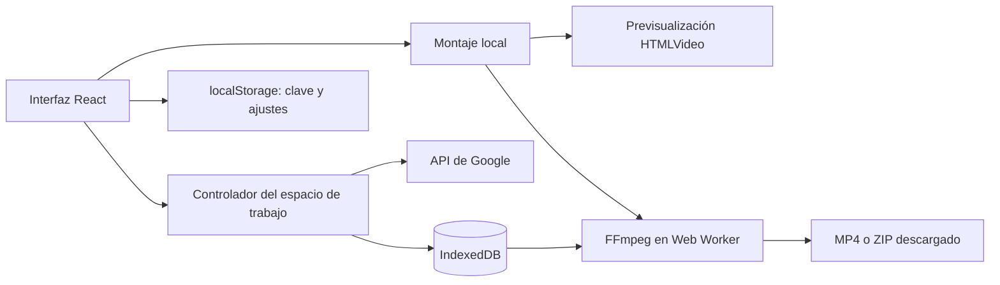

# Arquitectura

[Documentación](README.md)

## Vista general

Aplicación estática React 19 + TypeScript + Vite. El navegador contiene la interfaz, el almacenamiento, la cola de trabajo y el motor de exportación. No hay API propia, autenticación de usuarios, base de datos remota ni sincronización.

## Mapa del código

| Área                    | Archivos                                                                            | Responsabilidad                                                           |
| ----------------------- | ----------------------------------------------------------------------------------- | ------------------------------------------------------------------------- |
| Entrada y navegación    | `src/main.tsx`, `src/ui/StudioApp.tsx`                                              | Montaje de React, rutas por hash, proyectos y vistas                      |
| Contratos de datos      | `src/types.ts`                                                                      | Proyectos, clips, versiones, referencias, solicitudes y tomas del montaje |
| Persistencia            | `src/lib/storage.ts`, `src/lib/settings.ts`                                         | IndexedDB, operaciones de almacenamiento, clave y preferencias            |
| Orquestación            | `src/lib/useWorkspace.ts`                                                           | Cola serial, captura de solicitudes, pausa, reintento y notificaciones    |
| Google                  | `src/lib/google.ts`, `src/lib/referenceImages.ts`                                   | REST, validación, respuestas, descargas y preparación de referencias      |
| Biblioteca y generación | `src/ui/ProjectWorkspace.tsx`, `src/ui/Editor.tsx`                                  | Revisión de clips y modal de generación/edición/extensión                 |
| Referencias             | `src/ui/ReferencePicker.tsx`, `src/ui/VideoReferences.tsx`                          | Selección visual, cargas y roles                                          |
| Montaje                 | `src/lib/timeline.ts`, `src/ui/SequenceEditor.tsx`                                  | Resolución temporal, recortes, historial local y reproducción             |
| Miniaturas              | `src/ui/SequenceFilmstrip.tsx`                                                      | Muestreo local, caché por Blob y carga cercana al área visible            |
| Procesamiento           | `src/lib/videoEngine.ts`, `src/lib/export.ts`                                       | Worker exclusivo, FFmpeg, escalado, cortes y concatenación                |
| Descargas               | `src/lib/archive.ts`, `src/ui/DownloadDialog.tsx`, `src/ui/VideoDownloadDialog.tsx` | Nombres, ZIP, manifiesto opcional y selección de resolución               |
| Presentación            | `src/ui/studio.css`, `src/ui/sequence.css`, `DESIGN.md`                             | Sistema visual y adaptación de pantallas                                  |

## Persistencia y compatibilidad

IndexedDB conserva el nombre `vid-gen-studio`, versión de esquema 1, y los almacenes `projects`, `scenes`, `assets` y `usage_logs`. `scenes` tiene un índice `by-project`. Los campos nuevos son opcionales para leer registros anteriores; una migración estructural futura debe incrementar la versión y preservar los blobs.

- `Project`: nombre, fechas, IDs de clips del montaje y `sequence_items` cuando existe un montaje detallado.
- `Scene`: borrador, ajustes, referencias, estado, versiones y solicitudes pendientes. `origin` enlaza un clip derivado con su fuente.
- `ClipVersion`: Blob, prompt, ajustes, duración declarada e identificador de interacción cuando existe.
- `Asset`: imagen como data URL, tipo y vinculación global o por proyectos.
- `SequenceItem`: ID de la toma, `scene_id`, versión fijada si existe, entrada, salida y volumen. Repetir un vídeo no duplica su blob en el proyecto.

`sceneBlob` y `activeVersion` leen la versión activa con compatibilidad para el antiguo `video_blob`. Las URL `blob:` se crean para reproducir y se revocan; no son enlaces duraderos que puedan compartirse.

`usage_logs` se conserva por compatibilidad; no representa una factura de Google ni permite calcular cargos reales. La clave está separada en localStorage; consulta [privacidad](privacy.md).

## Ciclo de generación

1. El usuario confirma una solicitud y su cantidad de clips.
2. Se capturan prompt, ajustes y referencias; cada salida tiene su clip y entrada de cola.
3. Las entradas se guardan antes de cerrar el modal. La cola procesa una solicitud cada vez.
4. Se prepara la copia de las referencias y se envía la solicitud.
5. Cuando Google devuelve un identificador remoto, se persiste para poder consultar el resultado.
6. Al terminar, se guarda el Blob como versión. Un fallo no elimina un resultado anterior.

La cola vive en el controlador del espacio de trabajo, fuera del modal. Recargar destruye la ejecución en memoria: las solicitudes persistidas vuelven pausadas y requieren continuación o recuperación explícita. No hay service worker que siga ejecutándolas con la pestaña cerrada.

Una interrupción antes de recibir un ID remoto es ambigua. No se puede garantizar idempotencia de un nuevo POST. La recuperación con un ID conocido consulta el resultado sin crear otra generación. Véase [contrato de Google](google-api.md).

## Montaje no destructivo

`sequence_ids` conserva la compatibilidad y las marcas de la biblioteca. `sequence_items` representa las ocurrencias reales, permitiendo duplicados y divisiones. Los proyectos anteriores sin una secuencia explícita mantienen su orden heredado; los nuevos empiezan vacíos.

La duración leída del vídeo prevalece sobre la duración declarada por la generación. `resolveTimeline` aplica límites a los recortes y calcula los inicios consecutivos sin huecos. `splitSequence` transforma una toma en dos rangos contiguos de la misma fuente. La versión fijada evita cambiar una toma silenciosamente al seleccionar otra generación en la biblioteca.

La previsualización usa HTMLVideo y precarga la toma siguiente; no genera un archivo por cada cambio. La decodificación y el salto entre fuentes dependen del navegador. La referencia temporal del montaje es de 24 fps; no es un monitor de precisión para todos los códecs y dispositivos.

Los cambios se guardan serialmente. Deshacer/rehacer es un historial de la sesión del editor, no una pila persistida después de recargar. El bucle de revisión, el zoom, la vista ampliada y el panel móvil son controles temporales. Eliminar una toma del montaje no elimina el clip; la papelera de clips conserva las posiciones y recortes para su restauración.

## Exportación

El motor FFmpeg se importa bajo demanda y solo admite un trabajo a la vez. Cancelar termina el worker; el siguiente trabajo crea otro. Los archivos temporales se eliminan al terminar cuando el motor sigue disponible.

Los clips individuales en resolución Original conservan sus bytes. El escalado transcodifica el vídeo con Lanczos y conserva el audio por copia. Un montaje aplica los puntos de entrada/salida y el volumen, encaja cada toma en el formato elegido, normaliza a H.264/AAC y 24 fps, y concatena los resultados. Una toma recortada también pasa por ese proceso aunque sea la única.

El ZIP contiene medios y un manifiesto opcional; no es un formato de copia de seguridad ni una vía de importación al editor.

## Límites de diseño

No se implementan edición multipista, transiciones, títulos, importación general de vídeo externo, exportación XML/EDL, copias completas de proyectos, colaboración ni cuentas. Cualquier cambio en estas áreas necesita definir nuevos contratos; no debe simular una capacidad que el exportador no pueda reproducir.
